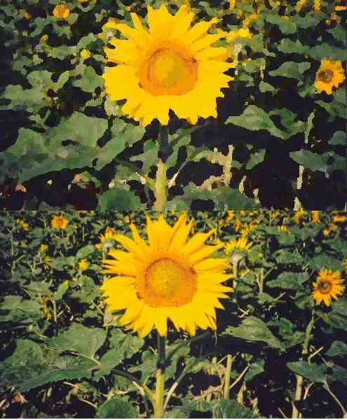



## Oil Paint

### Description

Convert Pictures to Oilpaintings. Fast (if compiled) and nice effect. I think this is the first VB version of such a effect. Please leave comments.
 
### More Info
 

             |
---                |---
**Submitted On**   |2003-12-12 20:23:58
**By**             |[Scythe](https://github.com/Planet-Source-Code/PSCIndex/blob/master/ByAuthor/scythe.md)
**Level**          |Advanced
**User Rating**    |5.0 (25 globes from 5 users)
**Compatibility**  |VB 5\.0, VB 6\.0
**Category**       |[Graphics](https://github.com/Planet-Source-Code/PSCIndex/blob/master/ByCategory/graphics__1-46.md)
**World**          |[Visual Basic](https://github.com/Planet-Source-Code/PSCIndex/blob/master/ByWorld/visual-basic.md)
**Archive File**   |[Oil\_Paint16832012132003\.zip](https://github.com/Planet-Source-Code/scythe-oil-paint__1-50428/archive/master.zip)

